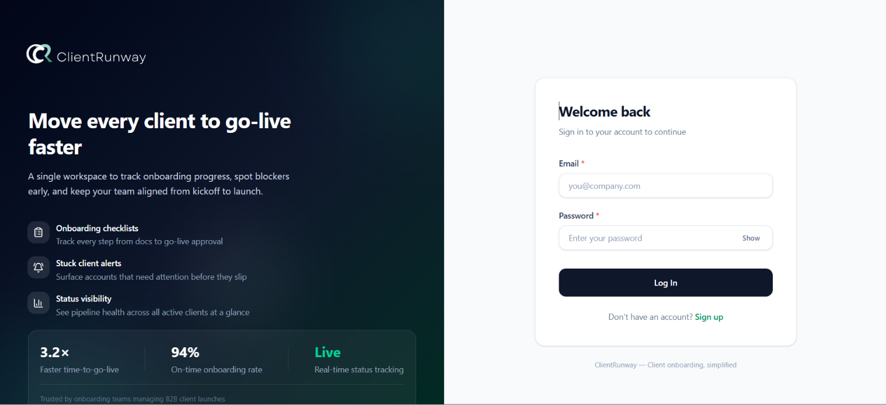
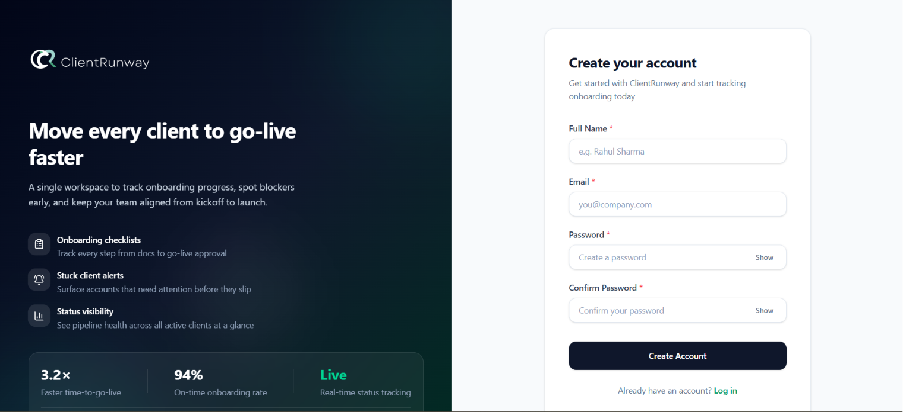
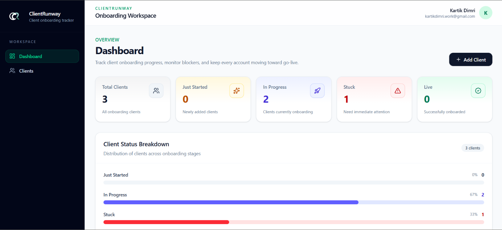
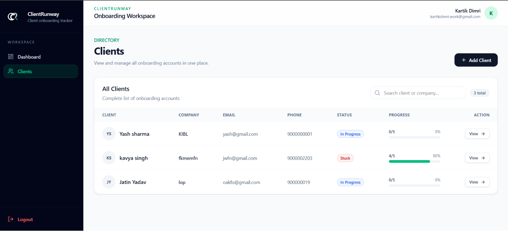
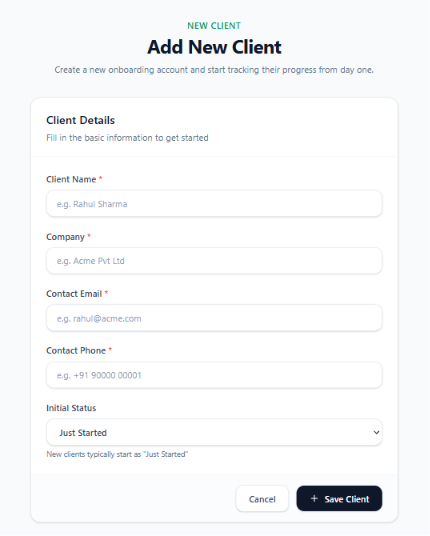
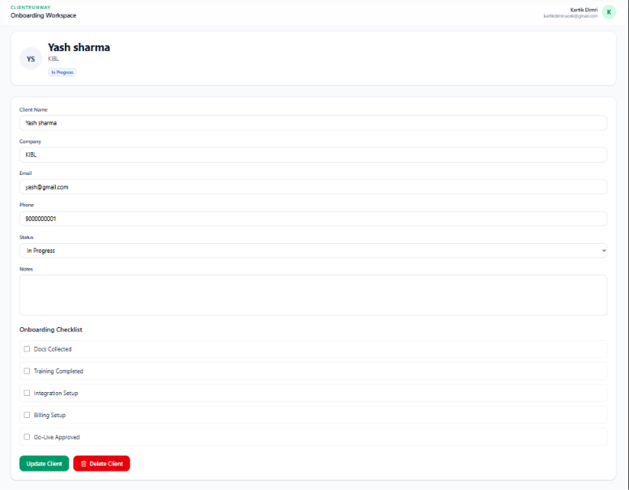

# 🚀 ClientRunway

ClientRunway is a full-stack MERN application that helps businesses manage and track client onboarding efficiently. It provides a centralized dashboard where teams can create, manage, and monitor client onboarding progress from start to finish.

---

## 🌐 Live Demo

**Frontend:** https://client-runway.vercel.app

**Backend:** https://clientrunway.onrender.com

---

## ✨ Features

### Authentication
- User Registration
- Secure Login
- Logout
- JWT Authentication
- HTTP-only Cookie Authentication
- Protected Routes

### Client Management
- Add New Client
- Edit Client Details
- Delete Client
- View Client Information

### Client Tracking
- Update Client Status
- Onboarding Checklist
- Client Notes
- Dashboard Overview

### UI
- Responsive Design
- Toast Notifications
- Clean Dashboard Interface

---

## 🛠 Tech Stack

### Frontend
- React
- Vite
- Tailwind CSS
- React Router DOM
- Axios
- React Hot Toast
- Lucide React

### Backend
- Node.js
- Express.js
- MongoDB Atlas
- Mongoose
- JWT
- bcrypt
- Cookie Parser
- CORS

### Deployment
- Vercel
- Render

---

## 📁 Folder Structure

```
ClientRunway
│
├── Frontend
│   ├── src
│   ├── public
│   └── package.json
│
├── Backend
│   ├── src
│   ├── package.json
│   └── server.js
│
└── README.md
```

---

## ⚙️ Installation

### Clone the Repository

```bash
git clone https://github.com/YOUR_USERNAME/ClientRunway.git
```

### Install Dependencies

Frontend

```bash
cd client
npm install
```

Backend

```bash
cd server
npm install
```

---

## ▶️ Run Locally

### Backend

```bash
cd server
npm run dev
```

### Frontend

```bash
cd client
npm run dev
```

---

## 🔑 Environment Variables

### Server (.env)

```env
MONGO_URI=your_mongodb_connection_string

JWT_SECRET=your_jwt_secret

CLIENT_URL=http://localhost:5173
```

---

## 📸 Screenshots

### Login



### Singup



### Dashboard



### Client List



### Add Client



### Client Details



---

## 📚 What I Learned

- Building REST APIs using Express.js
- MongoDB CRUD Operations
- JWT Authentication
- Cookie-based Authentication
- Protected Routes
- React Routing
- State Management
- Axios API Integration
- Deployment using Vercel and Render
- Production CORS Configuration
- Cross-domain Cookie Authentication

---

## 🚀 Future Improvements

- Search Clients
- File Upload Support
- Pagination
- Email Notifications
- Role-Based Access Control
- Analytics Dashboard

---

## 👨‍💻 Author

**Kartik Dimri**

GitHub: https://github.com/kartikdimri09

LinkedIn: (Add Your LinkedIn)
